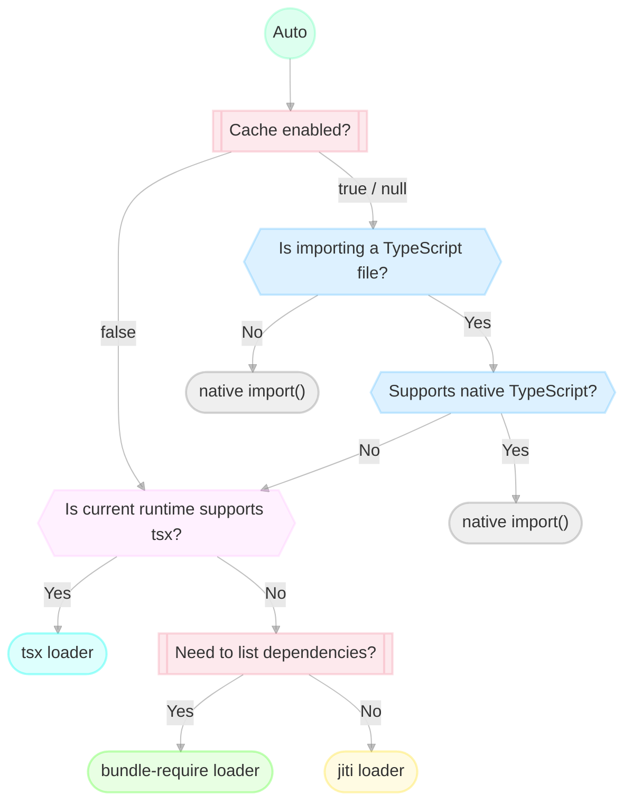

# importx

[![npm version][npm-version-src]][npm-version-href]
[![npm downloads][npm-downloads-src]][npm-downloads-href]
[![bundle][bundle-src]][bundle-href]
[![JSDocs][jsdocs-src]][jsdocs-href]
[![License][license-src]][license-href]

Unified tool for importing TypeScript modules at runtime.

- [`auto`](#auto)
- [`native`](#native)
- [`tsx`](#tsx)
- [`jiti`](#jiti)
- [`bundle-require`](#bundle-require)

## Motivation

It's a common need for tools to support importing TypeScript modules at runtime. For example, to support configure files written in TypeScript.

There are so many ways to do that, each with its own trade-offs and limitations. This library aims to provide a simple, unified API for importing TypeScript modules, providing an easy-to-use API, and making it easy to switch between different loaders.

By default, it also provides [a smart "auto" mode that decides the best loader based on the environment](#auto), trying to ease out their limitations and provide the best experience.

**The goal is for this library to swallow the complexity of the underlying implementations, where you can just focus on the feature set you need**. This library will keep up-to-date with the latest loaders and the runtime environment.

## Usage

```bash
npm i importx
```

```ts
const mod = await import('importx').then(x => x.import('./path/to/module.ts', import.meta.url))
```

## Options

You can turn the second argument of `import` into an object to provide options:

```ts
const mod = await import('importx').then(x => x.import('./path/to/module.ts', {
  parentURL: import.meta.url, // *required

  // The following options are their default values
  cache: null, // false, if you want to always get a new module
  listDependencies: false, // true, if you need to get the list of dependencies
  loader: 'auto', // most of the time, you don't need to change this as they will be chosen automatically
}))
```

When `loader` is not provided in the options explicitly, it will read from `IMPORTX_LOADER` environment variable, and then fall back to the `auto`.

## Loaders

### `auto`

Automatically choose the best loader based on the environment (if the below graph doesn't render, [click here to view it on GitHub](https://github.com/antfu-collective/importx#auto)).



### `native`

Use the native `import()` to import the module. According to the ESM spec, importing the same module multiple times will return the same module instance.

### `tsx`

Use [`tsx`](https://github.com/privatenumber/tsx)'s [`tsImport` API](https://tsx.is/node/ts-import) to import the module. Under the hood, it registers [Node.js loader API](https://nodejs.org/api/module.html#moduleregisterspecifier-parenturl-options) and uses [esbuild](https://esbuild.github.io/) to transpile TypeScript to JavaScript.

#### Pros

- Native Node.js loader API, consistent and future-proof.
- Get the file list of module dependencies. Helpful for hot-reloading or manifest generation.
- Supports [scoped registration](https://tsx.is/node/esm#scoped-registration), does not affect the global environment.

#### Limitations

- Requires Node.js `^18.18.0`, `^20.6.0` or above. Does not work on other runtime yet.

### `jiti`

Use [`jiti`](https://github.com/unjs/jiti) to import the module. It uses a bundled Babel parser to transpile modules. It runs in CJS mode and has its own cache and module runner.

#### Pros

- Self-contained, does not depend on esbuild.
- Own cache and module runner, better and flexible cache control. Works on the majority of Node-compatible runtimes.

#### Limitations

- ~~[Does not support top-level await yet](https://github.com/unjs/jiti/issues/72)~~ (supported in v2)
- Runs in CJS mode (transpiles all TS/ESM to CJS)

### `bundle-require`

Use [`bundle-require`](https://github.com/egoist/bundle-require) to import the module. It uses `esbuild` to bundle the entry module, saves it to a temporary file, and then imports it.

#### Pros

- Get the file list of module dependencies. Helpful for hot-reloading or manifest generation.

#### Limitations

- It creates a temporary bundle file when importing (will external `node_modules`).
- Can be inefficient where there are many TypeScript modules in the import tree.
- Imports are using esbuild's resolution, which might have potential misalignment with Node.js.
- Always import a new module, does not support module cache.

## Cache

By definition, ESM modules are always cached by the runtime, which means you will get the same module instance when importing the same module multiple times. In some scenarios, like a dev server watching for config file changes, the cache may not be desired as you want to get the new module with the latest code on your disk.

`importx` allows you to specify if you want to have the module cache or not, by providing the `cache` option:)

```ts
const mod = await import('importx')
  .then(x => x.import('./path/to/module.ts', {
    cache: false, // <-- this
    parentURL: import.meta.url,
  }))
```

Setting `cache: null` (default) means you don't care about the cache (if you only import the module once).

Note that some loaders always have a cache, and some loaders always have no cache. With the `auto` loader, we will choose the best loader based on your need. Otherwise, an unsupported combination will throw an error. For example:

```ts
// This will throw an error because `bundle-require` does not support cache.
const mod = await import('importx')
  .then(x => x.import('./path/to/module.ts', {
    cache: true,
    loader: 'bundle-require',
    parentURL: import.meta.url,
    // ignoreImportxWarning: true // unless you have this
  }))
```

## Get Module Info

You can get the extra module information by passing the module instance to `getModuleInfo`:

```ts
await import('importx')
  .then(async (x) => {
    const mod = await x.import('./path/to/module.ts', import.meta.url)
    const info = x.getModuleInfo(mod)
    console.log(
      info.loader, // the final loader used
      info.timestampInit, // timestamp when the module is initialized
      info.timestampLoad, // timestamp when the module is imported
      info.dependencies, // list of dependencies (available only in `tsx` and `bundle-require` loader),
      (info.timestampLoad - info.timestampInit) // time taken to load the module (in ms)
    )
  })
```

## List Module Dependencies

In cases like loading a config file for a dev server, where you need to watch for changes in the config file and reload the server, you may want to know the module's dependencies to watch for changes in them as well.

`tsx` and `bundle-require` loaders support listing the dependencies of the module. You can get the list of dependencies by [getting the module info](#get-module-info). To ensure you use always have the dependencies list in `auto` mode, you can set the `listDependencies` option to `true`:

```ts
const mod = await import('importx')
  .then(x => x.import('./path/to/module.ts', {
    listDependencies: true,
    parentURL: import.meta.url,
  }))
```

## Fallback Loaders

Since v0.4, importx supports fallback loaders when previous loaders fail to load the module. By default `['jiti']` will be used as it's the most compatible loader. You can customize the fallback loaders by setting the `fallbackLoaders` option:

```ts
const mod = await import('importx')
  .then(x => x.import('./path/to/module.ts', {
    fallbackLoaders: ['jiti', 'tsx'],
    parentURL: import.meta.url,
  }))
```

You can also disable fallback loaders by setting it to `false`:

```ts
const mod = await import('importx')
  .then(x => x.import('./path/to/module.ts', {
    fallbackLoaders: false,
    parentURL: import.meta.url,
  }))
```

## Runtime-Loader Compatibility Table

Importing a TypeScript module with `importx`:

<!-- TABLE_START -->

> Generated with version `v0.4.2` at 2024-07-30T10:38:06.719Z

|  | jiti-v1 |
| ------- | --- |
| node | Import: ❌<br>Cache: ❌<br>No cache: ❌<br>Deps: ❌<br>CTS Import: ✅<br>ESM/CJS Mixed: ❌<br>Const Enum: ❌<br>Import ESM Dep: ❌ |

<!-- TABLE_END -->

## Features-Loader Table

|  | native | tsx | jiti | bundle-require |
| --------------------------- | --- | --- | --- | --- |
| Cache: `true`               | ✅ | ✅ | ✅ | ❌ |
| Cache: `false`              | ❌ | ✅ | ✅ | ✅ |
| List dependencies           | ❌ | ✅ | ✅ | ✅ |
| Runtimes other than Node.js | ✅ | ❌ | ✅ | ✅ |
| Native ESM Import           | ✅ | ✅ | ✅ | ✅ |
| Top-level await             | ✅ | ✅ | ✅ | ✅ |
| Runtime module type*        | ESM | ESM | CJS | ESM/CJS |

> *This indicates what's the module type for each loader to evaluate the modules. For `CJS`, it means the loader transpiles the module to CJS and executes it in CJS mode, which may have some limitations like top-level await.

## Sponsors

<p align="center">
  <a href="https://cdn.jsdelivr.net/gh/antfu/static/sponsors.svg">
    
  </a>
</p>

## License

[MIT](./LICENSE) License © 2024-PRESENT [Anthony Fu](https://github.com/antfu)

<!-- Badges -->

[npm-version-src]: https://img.shields.io/npm/v/importx?style=flat&colorA=080f12&colorB=1fa669
[npm-version-href]: https://npmjs.com/package/importx
[npm-downloads-src]: https://img.shields.io/npm/dm/importx?style=flat&colorA=080f12&colorB=1fa669
[npm-downloads-href]: https://npmjs.com/package/importx
[bundle-src]: https://img.shields.io/bundlephobia/minzip/importx?style=flat&colorA=080f12&colorB=1fa669&label=minzip
[bundle-href]: https://bundlephobia.com/result?p=importx
[license-src]: https://img.shields.io/github/license/antfu/importx.svg?style=flat&colorA=080f12&colorB=1fa669
[license-href]: https://github.com/antfu/importx/blob/main/LICENSE
[jsdocs-src]: https://img.shields.io/badge/jsdocs-reference-080f12?style=flat&colorA=080f12&colorB=1fa669
[jsdocs-href]: https://www.jsdocs.io/package/importx
