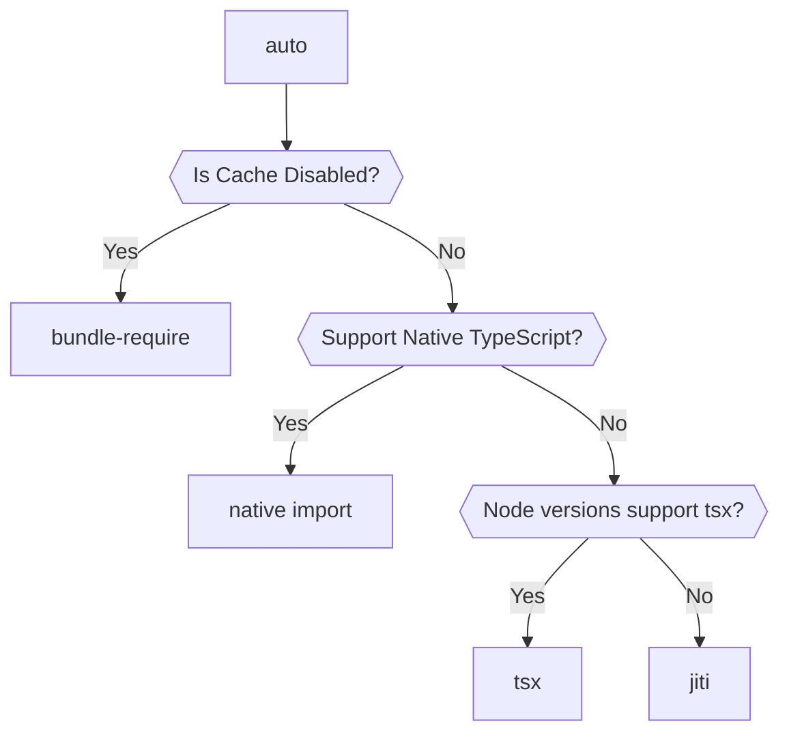

# importx

[![npm version][npm-version-src]][npm-version-href]
[![npm downloads][npm-downloads-src]][npm-downloads-href]
[![bundle][bundle-src]][bundle-href]
[![JSDocs][jsdocs-src]][jsdocs-href]
[![License][license-src]][license-href]

Unified tool for importing TypeScript modules at runtime.

Multi-strategies based on the environment:

- Use native `import()` for runtimes that support directly importing TypeScript modules (Deno, Bun, or `ts-node`, `tsx` CLI).
- Use `tsx` for modern module environments.
- Use `jiti` for older Node.js that don't support `tsx`.
- Use `bundle-require` when you want to import a module without the ESM cache.

## Usage

```bash
npm i importx
```

```ts
const mod = await import('importx').then(x => x.import('./path/to/module.ts', import.meta.url))
```

## Loaders

### `auto`

Automatically choose the best loader based on the environment.



### `native`

Use the native `import()` to import the module.

### `tsx`

Use [`tsx`](https://github.com/privatenumber/tsx)'s [`tsImport` API](https://tsx.is/node#tsimport) to import the module. Under the hood, it registers [Node.js loader API](https://nodejs.org/api/module.html#moduleregisterspecifier-parenturl-options) and uses [esbuild](https://esbuild.github.io/) to transpile TypeScript to JavaScript.

### `jiti`

Use [`jiti`](https://github.com/unjs/jiti) to import the module. It uses a bundled Babel parser to transpile modules. It runs in CJS mode and has its own cache and module runner.

> It does not support top-level await yet, and might have some potential misalignments with Node.js native module resolutions.

### `bundle-require`

Use [`bundle-require`](https://github.com/egoist/bundle-require) to import the module. It uses `esbuild` to bundle the entry module, saves it to a temporary file, and then imports it.

> It creates a temporary bundle file on importing (will external `node_modules`). Can be inefficient for there is a lot of TypeScript source files to be bundled.

## Sponsors

<p align="center">
  <a href="https://cdn.jsdelivr.net/gh/antfu/static/sponsors.svg">
    
  </a>
</p>

## License

[MIT](./LICENSE) License © 2023-PRESENT [Anthony Fu](https://github.com/antfu)

<!-- Badges -->

[npm-version-src]: https://img.shields.io/npm/v/importx?style=flat&colorA=080f12&colorB=1fa669
[npm-version-href]: https://npmjs.com/package/importx
[npm-downloads-src]: https://img.shields.io/npm/dm/importx?style=flat&colorA=080f12&colorB=1fa669
[npm-downloads-href]: https://npmjs.com/package/importx
[bundle-src]: https://img.shields.io/bundlephobia/minzip/importx?style=flat&colorA=080f12&colorB=1fa669&label=minzip
[bundle-href]: https://bundlephobia.com/result?p=importx
[license-src]: https://img.shields.io/github/license/antfu/importx.svg?style=flat&colorA=080f12&colorB=1fa669
[license-href]: https://github.com/antfu/importx/blob/main/LICENSE
[jsdocs-src]: https://img.shields.io/badge/jsdocs-reference-080f12?style=flat&colorA=080f12&colorB=1fa669
[jsdocs-href]: https://www.jsdocs.io/package/importx
